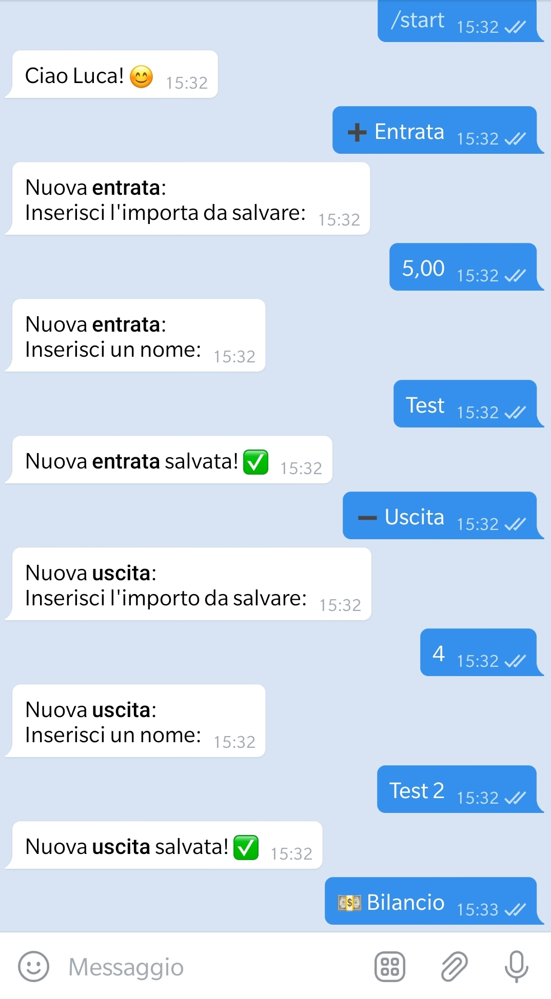
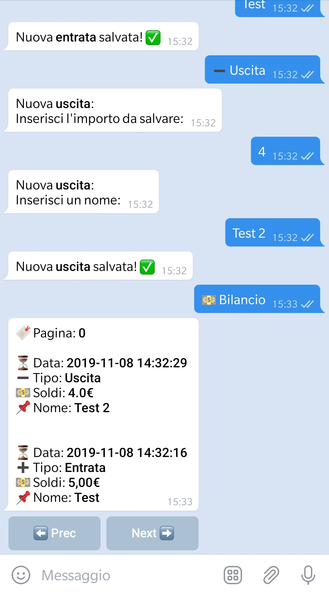

# Money Manager Bot
A money manager Telegram bot as simple as possible. It's ugly, but it works. I coded this at the beginning of my Python journey.

## Installation
```bash
python3 -m venv venv/
source venv/bin/activate
pip install -r requirements.txt
cd src/
sed 's/INSERT_TOKEN_HERE/YOUR_TOKEN/' -i src/Main.py
python CreateDB.py
python Main.py
```

## Screenshot
<p align="center">
    
    
</p>